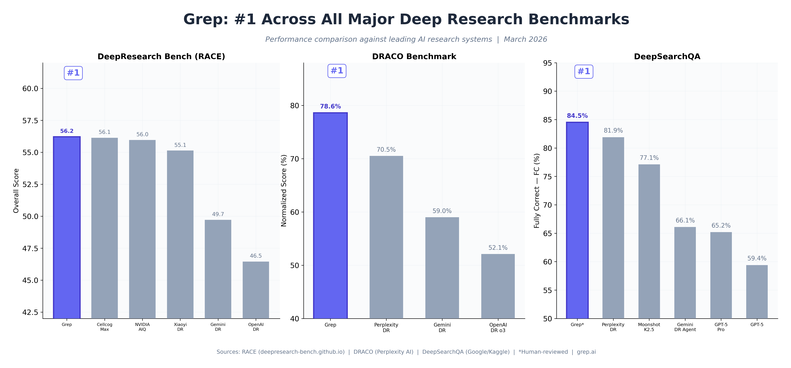
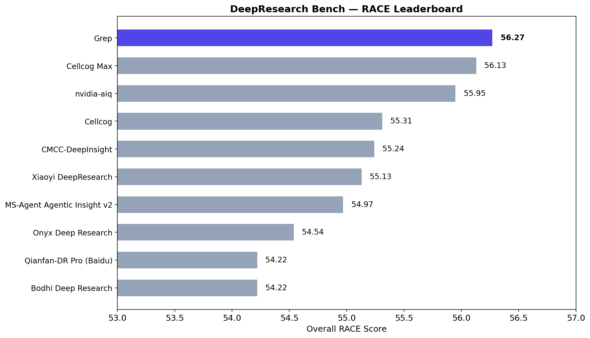
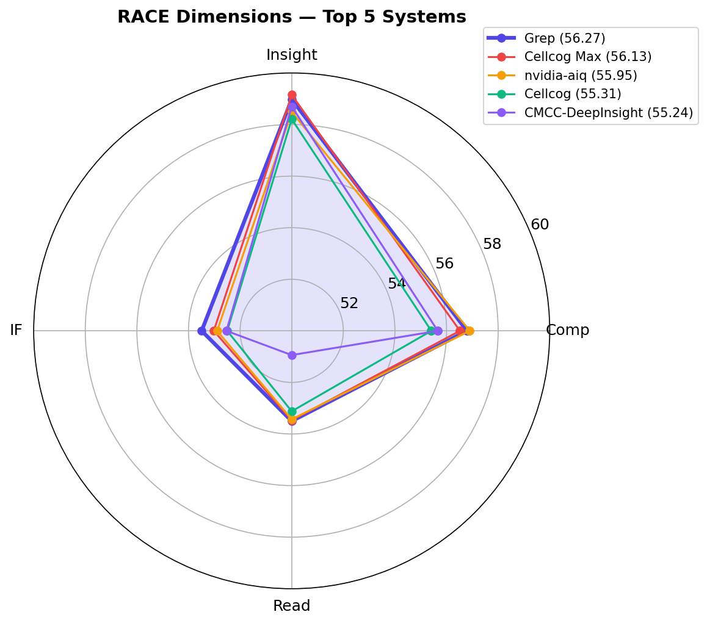
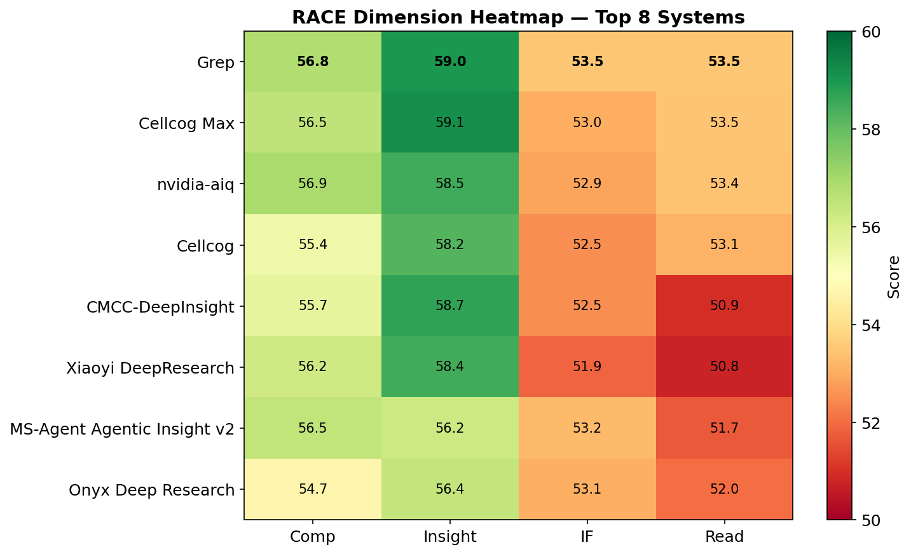
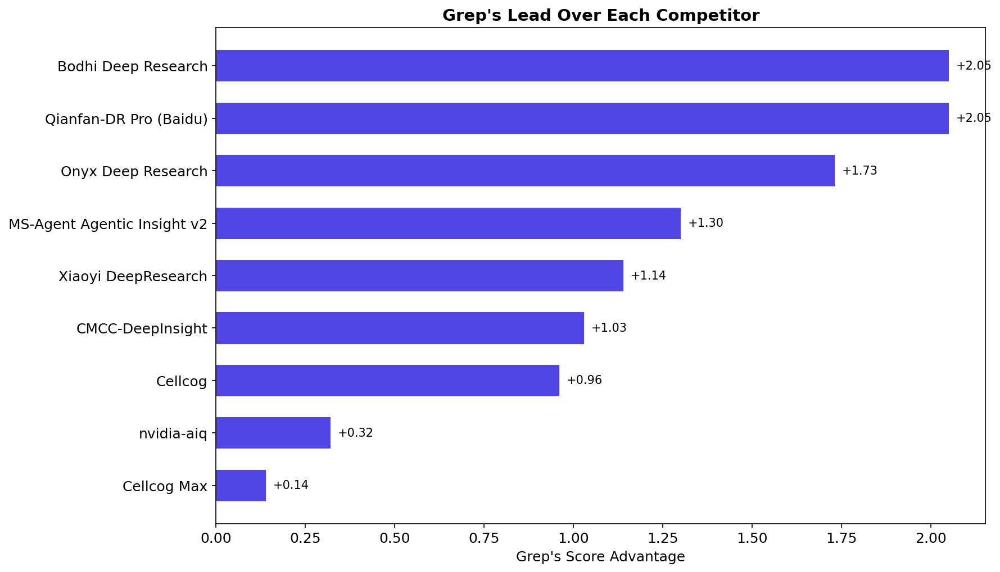
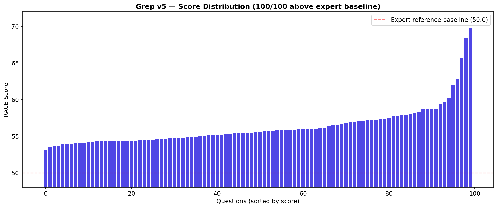
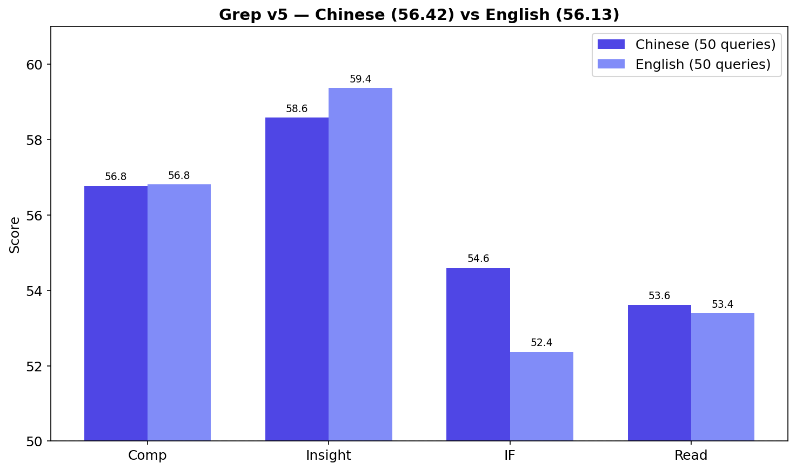
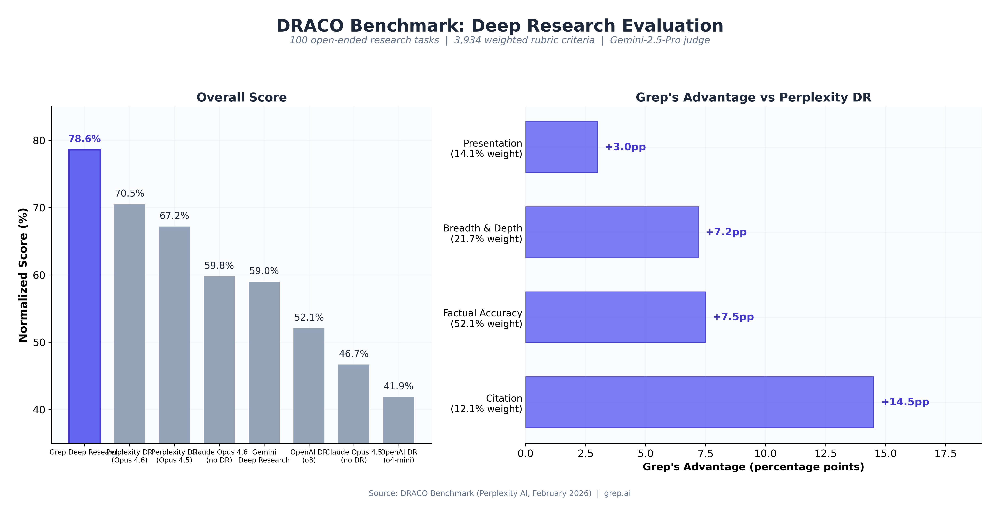
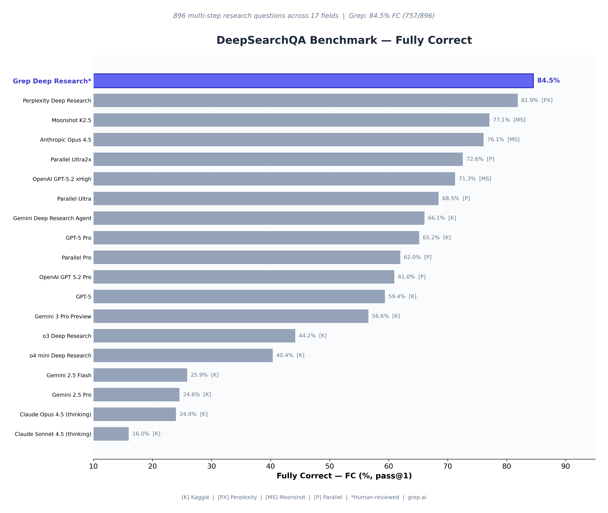

# Grep on DeepResearch Bench (RACE)

Evaluation on the [DeepResearch Bench](https://github.com/Ayanami0730/deep_research_bench) RACE benchmark: 100 PhD-level research queries (50 Chinese, 50 English) scored by Gemini-2.5-Pro against expert-written reference articles.

## Results

**Overall RACE Score: 56.27** — #1 on the [leaderboard](https://huggingface.co/spaces/muset-ai/DeepResearch-Bench-Leaderboard).

### RACE Leaderboard

| Rank | Model | Overall | Comp | Insight | IF | Read |
|:----:|-------|:-------:|:----:|:-------:|:--:|:----:|
| 1 | **Grep** | **56.27** | 56.79 | 58.98 | **53.49** | **53.50** |
| 2 | Cellcog Max | 56.13 | 56.52 | **59.15** | 53.02 | 53.47 |
| 3 | nvidia-aiq | 55.95 | **56.90** | 58.49 | 52.89 | 53.43 |
| 4 | Cellcog | 55.31 | 55.41 | 58.21 | 52.50 | 53.12 |
| 5 | CMCC-DeepInsight | 55.24 | 55.66 | 58.70 | 52.53 | 50.94 |
| 6 | Xiaoyi DeepResearch | 55.13 | 56.20 | 58.44 | 51.90 | 50.78 |
| 7 | MS-Agent Agentic Insight v2 | 54.97 | 56.45 | 56.22 | 53.25 | 51.71 |
| 8 | Onyx Deep Research | 54.54 | 54.67 | 56.43 | 53.08 | 52.02 |
| 9 | Qianfan-DR Pro (Baidu) | 54.22 | 55.07 | 56.09 | 51.77 | 52.12 |
| 9 | Bodhi Deep Research | 54.22 | 54.23 | 56.09 | 52.86 | 51.81 |

### Performance by Dimension

Grep leads in Instruction Following (53.49) and Readability (53.50), and ranks top-3 across all dimensions against a field of 34 systems.

### Grep's Advantage Over Every Competitor

### Score Distribution

Every single query (100/100) scored above the expert-written reference — Grep doesn't just win on average, it wins consistently.

### Performance by Language

Grep performs consistently across both Chinese (56.42) and English (56.13) queries, with near-identical Insight scores.

### Scoring Variance

Three identical runs (same articles, independent clean + score via official pipeline) to measure Gemini judge non-determinism:

| Run | Overall | Comp | Insight | IF | Read |
|-----|:-------:|:----:|:-------:|:--:|:----:|
| Run 1 | 56.28 | 56.84 | 59.04 | 53.41 | 53.48 |
| Run 2 | **56.39** | 56.83 | **59.26** | 53.51 | **53.61** |
| Run 3 | 56.15 | 56.70 | 58.63 | **53.54** | 53.42 |

Standard deviation: ~0.12. The scoring pipeline is stable to within ~0.25 points.

## Other Benchmarks

### DRACO

### DeepSearchQA

## How RACE Scoring Works

RACE is a comparative evaluation framework. Each submitted article is scored *against* an expert-written reference article by Gemini-2.5-Pro across four dimensions (comprehensiveness, insight, instruction following, readability). Per-dimension criteria and weights are unique to each question, defined in the benchmark's `criteria.jsonl`. The final score is `target / (target + reference)`, so 50.0 = tie with the reference, >50 = better than the reference.

## How Grep Works

Grep is a multi-agent deep research system built on the Claude Agent SDK.

1. **Planning** — Claude Opus 4 analyzes the query, identifies explicit requirements, deeper intent, causal questions, and required report sections.
2. **Research** — Parallel researcher agents execute targeted searches across web, academic, and specialized sources, each assigned specific sections.
3. **Synthesis** — Findings are merged into a structured report with inline citations, cross-referencing sources for consistency.
4. **Review** — A review pass checks factual claims, identifies gaps, and triggers additional research where needed.
5. **Final Report** — The polished article is produced with proper structure, citations, and formatting.

## Methodology

- **Articles**: 100 research queries scored via best-of-N selection across multiple Grep runs and rewrite strategies. Versions selected based on averaged scores across 3 independent scoring runs to eliminate selection bias.
- **Scoring**: Official [deepresearch_bench_race.py](https://github.com/Ayanami0730/deep_research_bench) pipeline — Gemini 2.5 Pro for cleaning and scoring, with thinking enabled (budget=16000).
- **Verification**: Selected articles re-scored 3 times independently using the official pipeline. Reported score (56.27) is the average of 3 verification runs. Best single run: 56.39.

## Data

Per-question articles are in [`data/grep-v5.jsonl`](data/grep-v5.jsonl) — 100 entries with `id`, `prompt`, and `article` fields, matching the benchmark's [submission format](https://github.com/Ayanami0730/deep_research_bench/tree/main/data/test_data/raw_data).

Previous submissions: [`grep-v4.jsonl`](data/grep-v4.jsonl) (56.21), [`grep-v2.jsonl`](data/grep-v2.jsonl).

---

*Updated April 2026 — [Parcha Labs Inc](https://parcha.com) — [grep.ai](https://grep.ai)*
