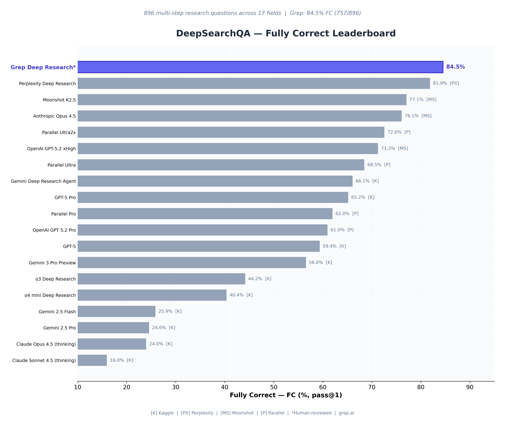
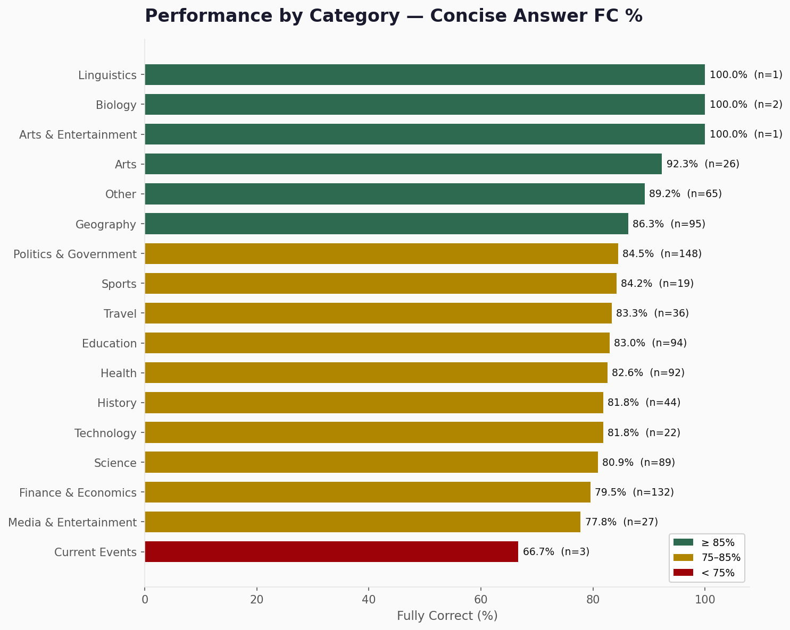

# DeepSearchQA Benchmark Report

**Grep Deep Research — Unofficial Evaluation**

*February 2026*

---

| Metric | Value |
|--------|-------|
| **Adjusted FC (pass@1)** | **84.5%** (757 / 896) |
| Automated FC (concise answer) | 83.4% (747 / 896) |
| Avg F1 (concise answer) | 0.915 |
| Questions Evaluated | 896 of 900 (4 missing ground truth) |
| Model | Claude Opus 4.6 |

---

## Unofficial Leaderboard

Compiled from Kaggle [K], Perplexity [PX], Moonshot [MS], and Parallel [P]. All results are pass@1.



| # | System | FC (%) | Source |
|---|--------|:---:|--------|
| **--** | **Grep Deep Research** | **84.5**\* | Ours |
| 1 | Perplexity Deep Research | 81.9 | [PX] |
| 2 | Moonshot K2.5 | 77.1 | [MS] |
| 3 | Anthropic Opus 4.5 | 76.1 | [MS] |
| 4 | Parallel Ultra2x | 72.6 | [P] |
| 5 | OpenAI GPT-5.2 xHigh | 71.3 | [MS] |
| 6 | Parallel Ultra | 68.5 | [P] |
| 7 | Gemini Deep Research Agent | 66.1 ±3.2 | [K] |
| 8 | GPT-5 Pro | 65.2 ±3.1 | [K] |
| 9 | Parallel Pro | 62.0 | [P] |
| 10 | OpenAI GPT 5.2 Pro | 61.0 | [P] |
| 11 | GPT-5 | 59.4 ±3.2 | [K] |
| 12 | Gemini 3 Pro Preview | 56.6 ±3.2 | [K] |
| 13 | o3 Deep Research | 44.2 ±3.3 | [K] |
| 14 | o4 mini Deep Research | 40.4 ±3.2 | [K] |
| 15 | Gemini 2.5 Flash | 25.9 ±2.9 | [K] |
| 16 | Gemini 2.5 Pro | 24.6 ±2.8 | [K] |
| 17 | Claude Opus 4.5 (thinking) | 24.0 ±2.9 | [K] |
| 18 | Claude Sonnet 4.5 (thinking) | 16.0 ±2.4 | [K] |

**\*** Human-reviewed. Automated concise-answer score: 83.4%. 9 questions had correct answers penalized by the autorater for including contextual labels, and 1 ground truth error was identified. See [Appendix A](#appendix-a-autorater-precision-penalty-cases) and [Appendix B](#appendix-b-ground-truth-error).

**Sources:** [K] = Kaggle (independently reproduced), [P] = Parallel, [PX] = Perplexity, [MS] = Moonshot.

---

## Methodology

### Dataset
- [DeepSearchQA](https://arxiv.org/abs/2505.15420) (Google, January 2025)
- 900 questions total, 896 with ground truth
- 17 categories spanning finance, science, politics, health, geography, and more
- Mix of single-answer (316) and set-answer (580) questions

### Agent Configuration
- Grep Deep Research pipeline
- Model: Claude Opus 4.6 (`opus46_solo` config profile)
- Search: `all_tools_tiered` (web, academic, code execution)
- Depth: `medium` effort
- Single attempt per question (pass@1)

### Evaluation Protocol
- Autorater: Gemini 2.5 Flash (paper's official judge)
- Input: Structured concise answer extracted from full research report
- Scoring: Precision / Recall / F1 computed from autorater's Correctness Details and Excessive Answers (paper Section 3.1, Appendix A)
- Two-step process: LLM identifies correct/excessive items, then code computes P/R/F1

### Human Review
- All 149 non-perfect concise-answer results manually reviewed
- 9 autorater precision penalty errors identified (see [Appendix A](#appendix-a-autorater-precision-penalty-cases))
- 1 ground truth error identified (see [Appendix B](#appendix-b-ground-truth-error))
- Adjusted FC: 747 + 9 + 1 = 757 / 896 = **84.5%**

---

## Performance by Category



| Category | n | FC | FC % | Avg F1 |
|----------|---|-----|------|--------|
| Linguistics | 1 | 1 | 100.0% | 1.000 |
| Biology | 2 | 2 | 100.0% | 1.000 |
| Arts & Entertainment | 1 | 1 | 100.0% | 1.000 |
| Arts | 26 | 24 | 92.3% | 0.956 |
| Other | 65 | 58 | 89.2% | 0.935 |
| Geography | 95 | 82 | 86.3% | 0.926 |
| Politics & Government | 148 | 125 | 84.5% | 0.930 |
| Sports | 19 | 16 | 84.2% | 0.981 |
| Travel | 36 | 30 | 83.3% | 0.912 |
| Education | 94 | 78 | 83.0% | 0.948 |
| Health | 92 | 76 | 82.6% | 0.902 |
| History | 44 | 36 | 81.8% | 0.883 |
| Technology | 22 | 18 | 81.8% | 0.943 |
| Science | 89 | 72 | 80.9% | 0.899 |
| Finance & Economics | 132 | 105 | 79.5% | 0.875 |
| Media & Entertainment | 27 | 21 | 77.8% | 0.882 |
| Current Events | 3 | 2 | 66.7% | 0.667 |

All scores above are automated concise-answer FC using Gemini 2.5 Flash as judge.

---

## Insights

### Strengths

- **Consistent across categories** — 14 of 17 categories above 80% FC, demonstrating broad capability rather than narrow specialization.
- **Strong factual lookups** — Arts (92.3%), Other (89.2%), and Geography (86.3%) show the agent excels at finding specific, well-documented facts.
- **Single answer accuracy** — 86.4% FC on single-answer questions, outperforming set-answer questions by 4.7pp.
- **Top of the leaderboard** — At 84.5% adjusted FC (pass@1), Grep is +18.4pp above the Kaggle #1 (Gemini Deep Research Agent, 66.1%) and ahead of all self-reported results including Perplexity (81.9%) and Moonshot K2.5 (77.1%).
- **Highest average F1** — 0.915 concise-answer F1 indicates strong partial-credit performance even on imperfect answers.

### Weaknesses & Areas for Improvement

- **Finance & Economics (79.5%)** — Hardest major category. Many questions require precise numerical data from specific reports or databases behind paywalls.
- **Set Answer over-inclusion** — 81.7% FC on set answers. The agent sometimes includes extra items beyond the expected answer set, triggering precision penalties.
- **41 completely wrong answers (F1=0)** — The agent found the wrong data source, misinterpreted the question, or could not locate the required information.
- **Concise answer extraction loses information** — 34 questions where the full research report contains the correct answer but the concise extraction loses or reformats it, causing FC to drop. See [Feedback for DeepSearchQA Team](#feedback-for-deepsearchqa-team) for analysis.

---

## Question-by-Question Results

Scores for all 896 questions are in [`data/feb-2026/results.json`](data/feb-2026/results.json).

Each entry includes both **concise answer** and **full report** scores from the Gemini 2.5 Flash autorater:

```json
{
  "question_id": "dsqa_001",
  "category": "Politics & Government",
  "answer_type": "Single Answer",
  "concise_f1": 1.0,
  "concise_precision": 1.0,
  "concise_recall": 1.0,
  "full_report_f1": 1.0,
  "full_report_precision": 1.0,
  "full_report_recall": 1.0
}
```

> **Note:** We intentionally exclude ground truth answers and our agent's responses from this dataset. DeepSearchQA is a live benchmark — publishing answer pairs in a public repo would risk polluting the evaluation by allowing AI agents to retrieve them via web search instead of performing genuine research. Scores only. Researchers interested in the full data (including answers) can reach out to us at [grep.ai](https://grep.ai).

### Summary Comparison

| Scoring Method | FC | FC % | Avg F1 | Zero-F1 |
|---------------|-----|------|--------|---------|
| Concise Answer | 747 | 83.4% | 0.915 | 41 |
| Full Report | 778 | 86.8% | 0.934 | 35 |
| Delta | +31 | +3.4pp | +0.019 | -6 |

---

## Feedback for DeepSearchQA Team

We ran the DeepSearchQA autorater (Gemini 2.5 Flash) using both the official methodology (evaluating the concise answer) and an alternative approach (evaluating the full research report). The comparison reveals several issues with the evaluation framework that we believe are worth flagging for the benchmark maintainers.

### 1. Full-Report Scoring Inflates Results (A Red Herring)

Evaluating the full research report instead of the concise answer produces **+3.4pp FC** (86.8% vs 83.4%). This is a red herring — it doesn't mean the agent performed better. The full report contains more text, which gives the autorater more surface area to find matching information, even when the agent didn't cleanly identify the answer.

The 31 questions that flip from not-FC to FC when using full-report scoring represent cases where the correct answer is _somewhere_ in the report but the agent's concise extraction failed to capture it cleanly. This inflates the score without reflecting genuine improvement in answer quality.

**Recommendation:** The paper's choice to evaluate concise answers is correct. Full-report evaluation should be discouraged as a reporting methodology because it rewards verbose output over precise answers.

### 2. Concise Extraction Can Also Degrade Correct Answers

More surprisingly, we found **34 questions** where the full report scores FC (F1=1.0) but the concise answer does not. These fall into several patterns:

**a) Over-contextualized concise answers (9 cases)** — The concise answer includes the correct information plus supplementary context that triggers precision penalties. Examples:

| QID | Ground Truth | Concise Answer | Issue |
|-----|-------------|---------------|-------|
| dsqa_876 | Hong Kong SAR | Hong Kong SAR, China | ", China" penalized |
| dsqa_799 | 5 | 5 commanders (Frederick Hauck, Michael Coats, ...) | Named the commanders |
| dsqa_083 | 209,550,294 | Brazil; 2021 population: 209,550,294 | Added country name |
| dsqa_173 | University of Wyoming | University of Wyoming, $25,868 | Added tuition amount |
| dsqa_757 | Capital Region rural district | Capital Region rural district (16 partial LSDs) | Added detail |
| dsqa_088 | Musser Fruit Research Farm | Musser Fruit Research Farm — largest peach at 3.6 inches... | Added measurement |
| dsqa_154 | Kyprolis | Kyprolis (carfilzomib), granted FDA... | Added generic name |
| dsqa_254 | 12/22/2023 (11:15), 02/02/2024 (08:45) | Last 2023 EO (EO 14114): Filed 12/22/2023 (11:15)... | Added EO numbers |
| dsqa_451 | West Bay | West Bay ward (Cllr Andrew Harvey, Green Party...) | Added councillor info |

All 9 have recall = 1.0 (all expected items found) but the "excessive answers" list includes contextual labels. These are correct answers that a human would accept without hesitation.

**b) Reformatted or restructured answers (15+ cases)** — The concise extraction restructures the answer in a way the autorater doesn't match. For example, `dsqa_597` expects a specific list of constituency names but the concise answer gives a structured summary ("21 English seats met both criteria...") that the autorater can't parse into the expected format, despite the full report containing all the names.

**c) Genuinely wrong concise answers (4 cases)** — The concise extraction actually produces a different (wrong) answer than what the full report contains. For example, `dsqa_679` (GT: "Flintshire") — the full report discusses the correct county but the concise answer incorrectly extracts "County Durham."

**Recommendation:** The autorater's precision penalty treats all "excessive" information equally — a genuinely wrong entity and a contextual label like "(carfilzomib)" both reduce precision by the same amount. A more nuanced penalty that distinguishes between wrong entities and supplementary context would reduce false penalties.

### 3. Anomalous Cases Where Concise Beats Full Report

We found **3 questions** where the concise answer scores FC but the full report does not:

| QID | Category | Concise F1 | Full F1 | Notes |
|-----|----------|-----------|---------|-------|
| dsqa_218 | Science | 1.000 | 0.400 | Full report text triggers excessive answer penalties |
| dsqa_326 | Science | 1.000 | 0.500 | Same issue — extra context in report body |
| dsqa_642 | Finance & Economics | 1.000 | 0.889 | Near-miss on full report |

These demonstrate the opposite problem: the full report contains the correct answer but _also_ contains additional discussion that the autorater marks as "excessive." The concise extraction strips this away, resulting in a cleaner match.

**Recommendation:** This confirms the value of concise-answer evaluation, but also highlights that the autorater needs better handling of surrounding context in long-form outputs.

### 4. Ground Truth Error

**dsqa_877**: Ground truth lists "Amsterdam" but the correct answer based on the underlying data is **Paris** (25.40 KtCO2/day). Our agent correctly answered Paris. See [Appendix B](#appendix-b-ground-truth-error).

### Summary of Recommendations

1. **Continue using concise-answer evaluation** as the primary metric — full-report scoring inflates results.
2. **Distinguish contextual labels from wrong entities** in the precision penalty — answers like "Hong Kong SAR, China" should not be penalized the same as genuinely incorrect information.
3. **Verify ground truth entries** where multiple high-performing systems disagree with the expected answer.
4. **Consider publishing concise vs. full report deltas** as a diagnostic — the gap reveals how well systems extract clean answers versus finding information somewhere in verbose output.

---

## Appendix A: Autorater Precision Penalty Cases

The DeepSearchQA autorater (Gemini 2.5 Flash) uses a two-step evaluation: (1) the LLM identifies which expected answers are present ("Correctness Details") and which extra items were included ("Excessive Answers"), then (2) code computes Precision/Recall/F1. The precision formula penalizes any excessive answer equally, whether it is a genuinely wrong entity or merely a contextual label.

We identified 9 cases where the agent's concise answer was correct but received a precision penalty for including contextual information:

| QID | Category | Auto F1 | Ground Truth | Our Answer | Excessive Items |
|-----|----------|---------|--------------|------------|-----------------|
| dsqa_876 | Geography | 0.667 | Hong Kong SAR | Hong Kong SAR, China | China |
| dsqa_799 | History | 0.250 | 5 | 5 commanders (Frederick Hauck, Michael Coats, Richard Richards, James Wetherbee, Steven Lindsey) | The 5 named commanders |
| dsqa_083 | Technology | 0.500 | 209,550,294 | Brazil; 2021 population: 209,550,294 | Brazil, 2021 population |
| dsqa_254 | Politics & Gov | 0.667 | 12/22/2023 (11:15), 02/02/2024 (08:45) | Last 2023 EO (EO 14114): Filed 12/22/2023 (11:15). First 2024 EO... | EO labels |
| dsqa_173 | Education | 0.667 | University of Wyoming | University of Wyoming, $25,868 | $25,868 |
| dsqa_757 | Politics & Gov | 0.667 | Capital Region rural district | Capital Region rural district (16 partial LSDs) | 16 partial LSDs |
| dsqa_451 | Politics & Gov | 0.400 | West Bay | West Bay ward (Cllr Andrew Harvey, Green Party, 3 absences / 4 meetings) | Councillor details |
| dsqa_088 | Science | 0.667 | Musser Fruit Research Farm | Musser Fruit Research Farm — largest peach at 3.6 inches... | Measurement details |
| dsqa_154 | Health | 0.400 | Kyprolis | Kyprolis (carfilzomib), granted FDA accelerated approval... | Generic name, FDA details |

In all 9 cases, the autorater confirmed all expected ground-truth items as correct (recall = 1.0), but the excessive answers list included contextual labels or supplementary data. The adjusted score treats these as FC = 1.0.

---

## Appendix B: Ground Truth Error

**dsqa_877**: The ground truth lists "Amsterdam" as the correct answer, but the correct answer based on the underlying data is **Paris** (25.40 KtCO2/day). Our agent correctly answered Paris. The automated score marks this as F1 = 0.0. The adjusted score treats this as FC = 1.0.

| Field | Value |
|-------|-------|
| Question ID | dsqa_877 |
| Category | Finance & Economics |
| Ground Truth | Amsterdam (incorrect) |
| Our Answer | Paris (25.40 KtCO2/day) |
| Auto F1 | 0.000 |
| Adjusted | 1.000 (GT error) |

---

## Appendix C: Raw Data

Scores for all 896 questions are in [`data/feb-2026/results.json`](data/feb-2026/results.json) — scores only, no answers. If you're a researcher interested in the full data, reach out to us at [grep.ai](https://grep.ai).

**Fields:**

| Field | Description |
|-------|-------------|
| `question_id` | DeepSearchQA question identifier |
| `category` | One of 17 topic categories |
| `answer_type` | "Single Answer" or "Set Answer" |
| `concise_f1` / `concise_precision` / `concise_recall` | Scores from evaluating the concise answer (Gemini 2.5 Flash) |
| `full_report_f1` / `full_report_precision` / `full_report_recall` | Scores from evaluating the full research report (Gemini 2.5 Flash) |

Ground truth and agent responses are intentionally excluded to avoid polluting the benchmark for other AI systems. Researchers interested in full data can contact us at [grep.ai](https://grep.ai).

---

*Generated February 2026 — [Parcha Labs Inc](https://parcha.com) — [grep.ai](https://grep.ai)*
