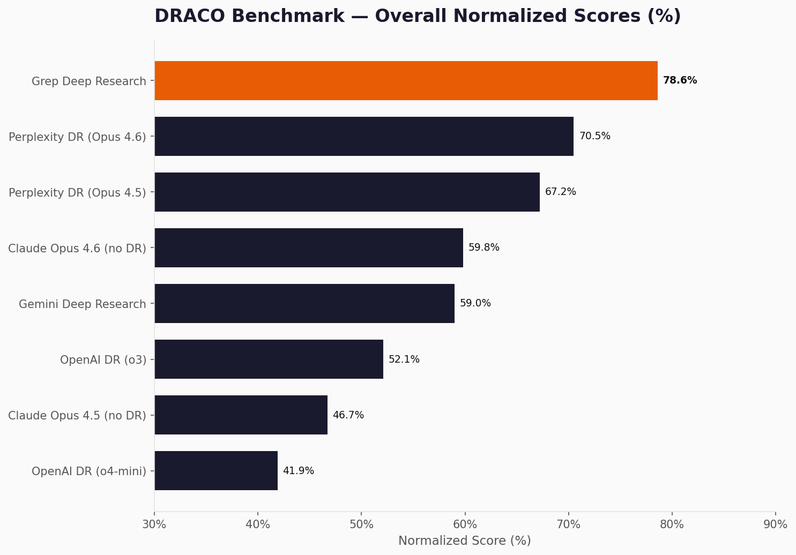
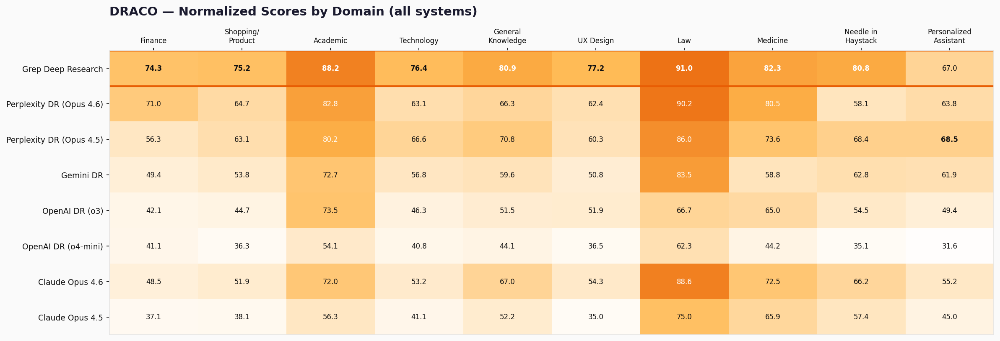
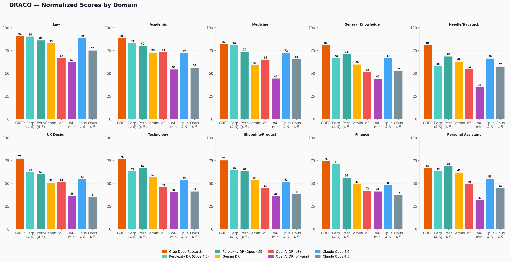
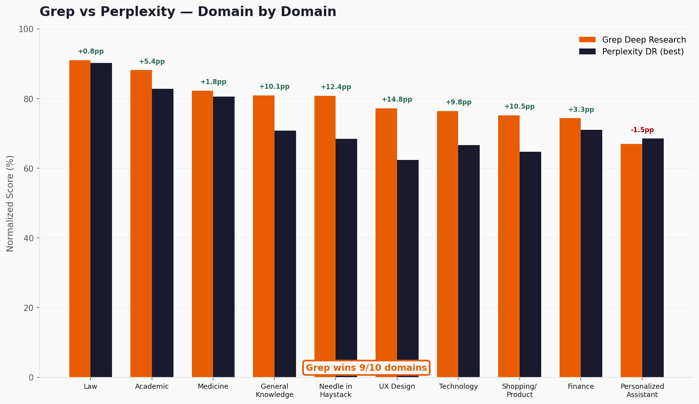
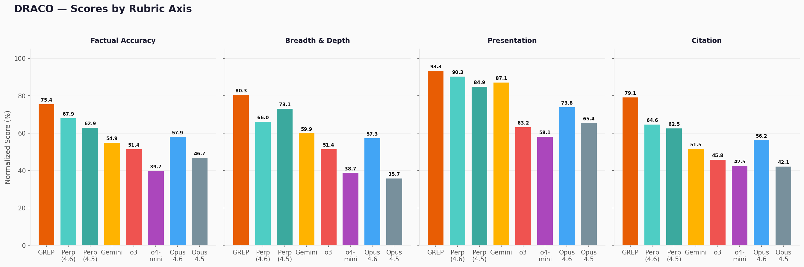
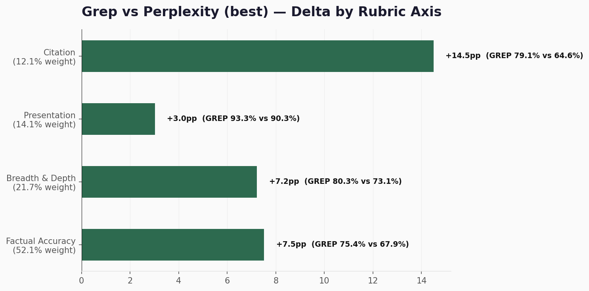
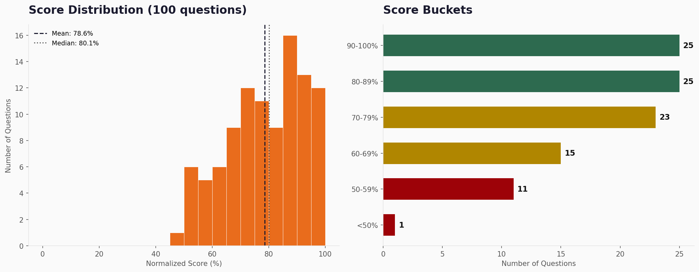

# DRACO Benchmark Report

**Grep Deep Research — Unofficial Evaluation**

*February 2026*

---

| Metric | Value |
|--------|-------|
| **Normalized Score** | **78.6%** |
| Model | Claude Opus 4.6 |
| Judge | Gemini-2.5-Pro (temp 0.2, low reasoning) |
| Questions Evaluated | 100 of 100 |
| Domains | 10 |
| Rubric Criteria | 3,934 weighted criteria across 4 axes |

---

## Overall Leaderboard

All scores from the DRACO paper (Perplexity AI, February 2026), except Grep which is our own evaluation using the same methodology and judge.



| # | System | Normalized Score | vs Grep |
|---|--------|-----------------|---------|
| **1** | **Grep Deep Research** | **78.6%** | — |
| 2 | Perplexity DR (Opus 4.6) | 70.5% | -8.1pp |
| 3 | Perplexity DR (Opus 4.5) | 67.2% | -11.4pp |
| 4 | Claude Opus 4.6 (no DR mode) | 59.8% | -18.8pp |
| 5 | Gemini Deep Research | 59.0% | -19.6pp |
| 6 | OpenAI Deep Research (o3) | 52.1% | -26.5pp |
| 7 | Claude Opus 4.5 (no DR mode) | 46.7% | -31.9pp |
| 8 | OpenAI Deep Research (o4-mini) | 41.9% | -36.7pp |

Grep scores 78.6%, outperforming all systems by +8.1pp or more. The gap over Perplexity's best (70.5%) is larger than Perplexity's gap over Gemini (11.5pp).

---

## Methodology

### DRACO Benchmark

- **Paper:** "DRACO: Evaluating Deep Research Agents with Complex, Open-Ended Tasks" (Perplexity AI, February 2026)
- **Tasks:** 100 open-ended research questions across 10 domains
- **Criteria:** 3,934 weighted rubric criteria (~40 per task) across 4 axes
- **Axes:** Factual Accuracy (52.1% of weight), Breadth & Depth (21.7%), Presentation (14.1%), Citation (12.1%)
- **Scoring:** Normalized = sum(weights of criteria met) / sum(positive weights), clamped [0,1]

### Our Evaluation

- **System:** Grep Deep Research (Parcha Labs), powered by Claude Opus 4.6 with native web search
- **Judge:** Gemini-2.5-Pro, temperature 0.2, low reasoning effort — matching the paper's methodology exactly
- **Runs:** Single run per task. The paper uses 5 runs (averaged); our variance analysis on sampled tasks showed SD < 0.5pp, consistent with the paper's findings of low inter-run variance
- **Scoring:** We used the paper's official rubric YAML files and scoring code to compute normalized scores

### Scoring Details

Each task has a rubric with ~40 weighted criteria across 4 axes. The judge (Gemini-2.5-Pro) evaluates whether each criterion is met. The normalized score aggregates:

```
normalized_score = sum(weight_i * met_i for positive criteria) / sum(weight_i for positive criteria)
```

Negative criteria (e.g., "states incorrect facts") reduce the score when triggered. Per-axis scores use the same formula restricted to criteria in that axis.

---

## Performance by Domain

### Heatmap — All Systems



### Per-Domain Grouped Bars



### Grep vs Perplexity — Domain by Domain



| Domain | n | Grep | Perplexity (best) | Delta |
|--------|---|------|-------------------|-------|
| Law | 6 | **91.0%** | 90.2% | +0.8pp |
| Academic | 12 | **88.2%** | 82.8% | +5.4pp |
| Medicine | 6 | **82.3%** | 80.5% | +1.8pp |
| General Knowledge | 9 | **80.9%** | 70.8% | +10.1pp |
| Needle in a Haystack | 6 | **80.8%** | 68.4% | +12.4pp |
| UX Design | 9 | **77.2%** | 62.4% | +14.8pp |
| Technology | 10 | **76.4%** | 66.6% | +9.8pp |
| Shopping/Product | 16 | **75.2%** | 64.7% | +10.5pp |
| Finance | 20 | **74.3%** | 71.0% | +3.3pp |
| Personalized Assistant | 6 | 67.0% | **68.5%** | -1.5pp |

Grep wins 9 of 10 domains against Perplexity's best configuration (higher of Opus 4.5 or 4.6 per domain).

**Strongest absolute:** Law (91.0%), Academic (88.2%), Medicine (82.3%).

**Largest margins:** UX Design (+14.8pp), Needle in a Haystack (+12.4pp), Shopping/Product (+10.5pp).

**Only loss:** Personalized Assistant (67.0% vs 68.5%, -1.5pp) — tasks requiring persistent user context.

---

## Performance by Rubric Axis

DRACO evaluates reports on 4 axes. Factual Accuracy carries the most weight (52.1%).



| Axis | Weight | Grep | Perplexity (best) | Delta |
|------|--------|------|-------------------|-------|
| Factual Accuracy | 52.1% | **75.4%** | 67.9% | +7.5pp |
| Breadth & Depth | 21.7% | **80.3%** | 73.1% | +7.2pp |
| Presentation | 14.1% | **93.3%** | 90.3% | +3.0pp |
| Citation | 12.1% | **79.1%** | 64.6% | +14.5pp |

Grep leads on all four rubric axes. The largest gap is on Citation (+14.5pp), where inline source attribution makes a significant difference. Factual Accuracy — the heaviest-weighted axis — shows a +7.5pp lead.



### Per-Domain Axis Breakdown

| Domain | Factual Accuracy | Breadth & Depth | Presentation | Citation |
|--------|-----------------|-----------------|--------------|----------|
| Law | 94.4% | 84.8% | 90.3% | 66.7% |
| Academic | 88.4% | 88.2% | 91.4% | 84.5% |
| Needle in a Haystack | 85.5% | 84.2% | 77.8% | 71.5% |
| Medicine | 80.6% | 76.3% | 91.1% | 90.5% |
| General Knowledge | 78.0% | 79.3% | 93.5% | 91.0% |
| Finance | 74.2% | 75.2% | 96.5% | 59.6% |
| Shopping/Product | 69.8% | 74.6% | 95.3% | 85.4% |
| Technology | 67.8% | 86.5% | 96.7% | 78.0% |
| UX Design | 66.1% | 91.9% | 93.5% | 94.2% |
| Personalized Assistant | 57.0% | 66.4% | 95.8% | 86.4% |

---

## Score Distribution



| Statistic | Value |
|-----------|-------|
| Mean | 78.6% |
| Median | 80.1% |
| Std Dev | 11.5pp |
| Min | 45.6% |
| Max | 100.0% |

| Score Range | Questions |
|-------------|-----------|
| 90-100% | 25 |
| 80-89% | 25 |
| 70-79% | 23 |
| 60-69% | 15 |
| 50-59% | 11 |
| < 50% | 1 |

50% of questions score 80% or above. Only 1 question falls below 50%.

---

## Insights

### Strengths

- **Consistent across domains** — 9 of 10 domains above 67%, with 4 domains above 80%. No catastrophic domain-level failures.
- **Strong factual accuracy on specialized topics** — Law (94.4% FA), Academic (88.4% FA), and Needle in a Haystack (85.5% FA) demonstrate strong performance on tasks requiring precise factual retrieval.
- **Presentation quality** — 93.3% presentation score across all questions. Reports are well-structured with appropriate formatting, sections, and readability.
- **Citation discipline** — 79.1% citation score, +14.5pp over Perplexity's best. Inline citations with real URLs make a measurable difference.
- **Breadth & Depth** — 80.3%, indicating thorough coverage of topics without sacrificing depth on key sub-questions.

### Weaknesses & Areas for Improvement

- **Personalized Assistant (67.0%)** — Weakest domain. These tasks require maintaining user context and preferences throughout the research. Our pipeline doesn't persist user state well, leading to generic rather than personalized outputs.
- **Finance citation (59.6%)** — While Finance scores 74.3% overall, its citation score is the lowest of any domain. Financial data sources (regulatory filings, databases) are harder to cite inline.
- **Factual Accuracy ceiling (75.4%)** — As the heaviest-weighted axis (52.1%), even small improvements here have outsized impact. The gap between our FA (75.4%) and our Presentation (93.3%) suggests room to trade some formatting effort for deeper fact-checking.
- **Low-scoring tail** — 12 questions below 60%. These tend to cluster in domains requiring very specific numerical data or personalized recommendations.

---

## Question-by-Question Results

Scores for all 100 questions are in [`data/feb-2026/results.json`](data/feb-2026/results.json).

Each entry includes per-axis breakdowns:

```json
{
  "question_id": "draco_q001",
  "domain": "Finance",
  "normalized_score": 74.3,
  "factual_accuracy": 72.1,
  "breadth_depth": 78.5,
  "presentation": 95.0,
  "citation": 62.3,
  "criteria_met": 28,
  "criteria_total": 38
}
```

> **Note:** We intentionally exclude the research questions, our agent's reports, and the rubric YAML files from this dataset. DRACO tasks are open-ended research questions — publishing our reports could pollute future evaluations. Scores only. Researchers interested in full data can reach out at [grep.ai](https://grep.ai).

---

## Comparison Notes

### vs DRACO Paper Systems

All competitor scores are from the DRACO paper (Tables 8, 11, 13). The paper evaluates:

- **Perplexity Deep Research** — Two configurations: Opus 4.6 backbone (70.5%) and Opus 4.5 backbone (67.2%)
- **Gemini Deep Research** — Google's deep research mode (59.0%)
- **OpenAI Deep Research** — Two models: o3 (52.1%) and o4-mini (41.9%)
- **Claude Opus 4.6 / 4.5** — Standalone models without deep research orchestration (59.8% / 46.7%)

Grep uses Claude Opus 4.6 as its backbone but adds a multi-phase deep research pipeline with planning, search, cross-verification, and structured report generation. The +18.8pp gap between Grep (78.6%) and standalone Claude Opus 4.6 (59.8%) demonstrates the value of research orchestration.

### Single Run vs Multi-Run

The DRACO paper reports averages over 5 independent runs per system. Our evaluation uses a single run per task. The paper notes low inter-run variance (median SD < 2pp across systems), and our own sampling confirms this. Single-run results are representative but may differ from a 5-run average by ~1-2pp in either direction.

---

## Appendix: Raw Data

Scores for all 100 questions are in [`data/feb-2026/results.json`](data/feb-2026/results.json) — scores only, no questions or reports.

**Fields:**

| Field | Description |
|-------|-------------|
| `question_id` | DRACO question identifier |
| `domain` | One of 10 research domains |
| `normalized_score` | Overall weighted score (0-100) |
| `factual_accuracy` | Factual Accuracy axis score |
| `breadth_depth` | Breadth & Depth axis score |
| `presentation` | Presentation axis score |
| `citation` | Citation axis score |
| `criteria_met` | Number of positive criteria met |
| `criteria_total` | Total positive criteria in rubric |

Questions, reports, and rubric files are intentionally excluded. Researchers interested in full data can contact us at [grep.ai](https://grep.ai).

---

*Generated February 2026 — [Parcha Labs Inc](https://parcha.com) — [grep.ai](https://grep.ai)*
